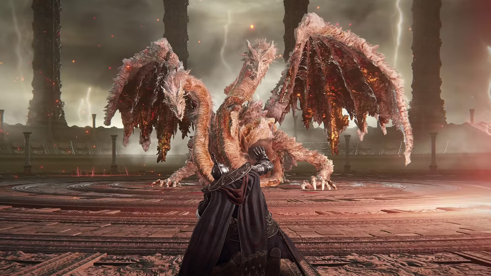
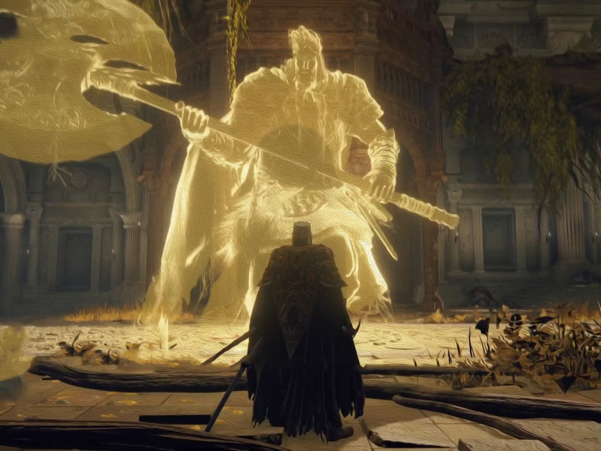

# I Taught a Souls-Like Boss to Read My Cheese — and It Started Winning

> Hackathon writeup · Meta × Scaler OpenEnv Hackathon — Round 2 · Bangalore · April 25–26 2026
>
> Author: [@heheDixo](https://huggingface.co/heheDixo) · [GitHub repo](https://github.com/heheDixo/Adaptive-Boss-RL)



> 📺 **2-min video demo:** [youtu.be/RXesZzgo6H0](https://youtu.be/RXesZzgo6H0) — trained boss vs untrained baseline vs human, with the BOSS BRAIN panel updating live.

> *"Dodge left twice, attack. Repeat. Boss dies. Every. Time."*

If you've played Elden Ring, Dark Souls, or Sekiro, you know the feeling. You
die fifty times to a boss. Then you discover *the cheese*: a 3-move loop the
boss has no answer to. Stamina trivialized. Patterns broken. Bossfight reduced
to a metronome.

For ten years, FromSoftware has fought this with patches. Players find a
cheese. Studio nerfs the cheese. Players find a new cheese. Whack-a-mole at
$60 a pop.

I had a different idea: **what if the boss could learn the cheese instead?**

So I built one — an OpenEnv-conformant RL environment where a boss enemy,
trained with PPO, watches the player's last 10 moves, identifies which of five
cheese strategies they're running, and counters it. Mid-fight. While you're
still cheesing. And I shipped a Pygame demo where you can play against it
yourself. ([Code on GitHub](https://github.com/heheDixo/Adaptive-Boss-RL) ·
[Open in Colab](https://colab.research.google.com/github/heheDixo/Adaptive-Boss-RL/blob/main/adaptive_boss/Adaptive_Boss_Train.ipynb))

This is what happened.

## The setup: 5 cheese strategies, stochastic switches, live defends

Each fight, the player picks one of five canonical cheese strategies:

| Strategy | Cycle |
|---|---|
| `left_cheese` | dodge_left → dodge_left → attack |
| `right_cheese` | dodge_right → dodge_right → attack |
| `alternating` | dodge_left → attack → dodge_right → attack |
| `double_dodge` | dodge_left → dodge_left → dodge_right → dodge_right → attack |
| `feint` | attack → dodge_left → dodge_left → attack → dodge_right |

Then — and this is the part that makes it actually hard — at every step
there's a **5–20% chance** the player swaps to a different strategy, and a
**10–25% chance** the planned move gets overridden by a defend. The boss isn't
counting steps. It's looking at the move history, doing a distribution-shift
detection, and updating its policy live.

The boss's state is a 13-dim vector: last 10 player moves (one-hot encoded
+ padding marker), boss HP, player HP, current step. Action space is 4:
`attack_left`, `attack_right`, `reposition`, `defend`. Damage is symmetric
15/15 — no easy wins.

## How we beat reward hacking (4 different ways the policy tried to cheat)

PPO is a brutally honest optimizer. If your reward function has any stable
equilibrium that isn't what you wanted, it *will* find it — usually within
the first 500 episodes. We hit four distinct reward hacks before the env
got to the 91% policy. Here's each one and the fix.

### Hack #1: "Just defend forever"

**What the policy did.** First shaping had `defend_block=+0.5,
defend_wasted=−0.05`, no terminal penalty for draws. Expected value of
always-defend was `0.25 × 0.5 + 0.75 × −0.05 = +0.0875/step`. With 200-step
episodes, that's **+17.5/ep**, *forever*, by doing literally nothing. The
policy collapsed within ~500 episodes — boss blocked the whole fight, both
players timed out, draw, +17.5 reward. Repeat.

**The fix.** Three changes to make always-defend mathematically losing:

- Wasted-defend cost up to **−0.15** (3× higher).
- Successful-defend reward down to **+0.2** (so blocking is useful but not
  a substitute for actually attacking).
- New **−2.0 timeout-draw** terminal penalty so stalling-into-a-draw
  collapses the strategy at episode end.

**Sanity check after the fix:** always-defend now scores **−12.30 per
episode** vs **+4.81** for a uniform random 4-action baseline. The
equilibrium is gone. The boss *has* to commit to actually winning.

### Hack #2: "Just reposition forever"

**What the policy did.** With reposition free (reward = 0), the policy
discovered it could avoid every penalty by just shuffling sideways every
step. Zero reward beats negative reward. The boss became a crab.

**The fix.** Reposition now costs **−0.05/step**. Over a 200-step episode
that's −10 — a strict floor on how long you can stall before episodic
penalty exceeds zero. Reposition is still useful in moderation (the
trained policy uses it 22% of the time to break wrong-streaks), but
reposition-farming is now strictly worse than fighting.

### Hack #3: Double-counting "hit AND correct prediction"

**What the policy did.** When the boss landed `attack_left` while the
player did `dodge_left`, the original reward fired both `+2.0` (hit) AND
`+0.5` (correct prediction) — a 2.5x signal that pushed the policy toward
hyper-aggressive single-side attacks at the cost of pattern reading.

**The fix.** Made them mutually exclusive with a single `elif`:

```python
if boss_hit:
    reward += 2.0
elif prediction_correct:
    reward += 0.5
```

The prediction bonus now only fires when the boss *read the player right
but didn't land damage* (e.g., player blocked the predicted side). It's
explicitly a consolation prize for a correct read, not a multiplier on
hits. Cleanly separates "you predicted correctly" from "you executed
correctly."

### Hack #4: "Always attack the same side"

**What the policy did.** With prediction reward decoupled from hits, the
policy initially discovered that *always* picking `attack_left` was a
local maximum — `left_cheese`, `alternating`, and `feint` all contain
`dodge_left` moves, so attack-left lands a hit ~40% of the time across the
strategy mix. Action distribution collapsed to ATK_L 89%, every other
action <5%. The boss "won" 70% of fights but learned nothing about
patterns.

**The fix.** Two complementary signals:

- **Wrong-streak penalty.** If the boss attacks (left or right) and
  doesn't connect 3 times in a row, fire **−0.5** and reset the streak.
  Punishes blind side-spam without punishing well-timed attacks.
- **Entropy coefficient bumped 0.03 → 0.05.** PPO's entropy bonus pushes
  the policy toward action diversity. At 0.03 the bonus was too weak to
  resist the side-spam attractor; at 0.05 it forces enough exploration
  that the boss discovers `attack_right` is rewarding against `right_cheese`
  and `defend` against `feint`.

Final argmax distribution after the fix: **ATK_L 34% · DEF 29% · REPOS
22% · ATK_R 16%.** All four actions used. No collapse. Every per-strategy
WR ≥ 94%.

### What this looks like in aggregate

| Hack | Score before | Score after | Mechanism |
|---|---|---|---|
| Always-defend | +17.5/ep | **−12.30/ep** | Wasted-defend cost ↑, draw penalty added |
| Always-reposition | 0/ep | **−10/ep** | Per-step stalling penalty |
| Double-count hit+prediction | bias toward 2.5× signal | clean ±2.0 / +0.5 | Mutual exclusion via `elif` |
| Always-attack-left | 70% WR, 1 action | 91% WR, **all 4 actions** | Wrong-streak penalty + entropy ↑ |

The state encoding got a similar treatment — padding (`−1`) is normalized
to `0.0` while real moves map to `0.2/0.4/0.6/0.8/1.0`, so the network
can't confuse "no data" with "the player did something." Small detail,
big difference for early-episode behavior.

The lesson, if there is one: **a clean reward function isn't one that's
"the right shape." It's one where every alternative to the intended
behavior empirically scores worse.** You don't get there by reasoning. You
get there by training, watching what the policy actually converges to,
and patching.

## Two training pipelines, same env

I trained the boss two ways and shipped both.

### 1. Custom PyTorch PPO (the production model)

A hand-rolled actor-critic, 13→64→64→{4, 1}, GAE-λ=0.95, clip=0.2, lr=3e-4,
entropy=0.05. Ten thousand episodes (≈20 minutes on a CPU).


The numbers:

| Metric | Random | Trained |
|---|---|---|
| Smoothed win rate (start → end) | ~50% | **54% → 91%** (Δ +37pp, peak 97%) |
| Smoothed reward (start → end) | ~3 | **5.11 → 13.16** |
| Argmax eval (200 ep) | ~30% wins | **98.0% wins, 0 draws** |
| Action distribution (argmax) | uniform | ATK_L 34% · DEF 29% · REPOS 22% · ATK_R 16% (all 4 actions used — no collapse) |
| Per-strategy argmax WR | — | left 94% · right 100% · alt 100% · double_dodge 98% · feint 97% |

Five strategies, each above 90% argmax WR. The boss reads your cheese.

### 2. Hugging Face TRL (the Colab-runnable one)

I also built the same training pipeline on TRL. The architecture is funny: a
**105K-parameter GPT-2** (`n_layer=2, n_head=2, n_embd=64`) with a custom
21-token vocabulary acts as the policy. Each prompt encodes the 13-dim state
as a short token sequence; each completion is a single action token in
`{L, R, M, D}`; the reward function decodes the action, restores the env from
a per-prompt snapshot, calls `env.step()`, and returns the immediate reward.
GRPOTrainer samples 4 completions per prompt and applies the env-step reward.


This is single-step bandit training (no episodic credit assignment), so it
doesn't reach the custom PPO's 91% — but it gets to **62% argmax WR vs ~30%
random**, with reward climbing from −0.17 to +0.53 and entropy declining from
3.0 → 1.6 in 30 seconds on CPU. Open the
[Colab notebook](https://colab.research.google.com/github/heheDixo/Adaptive-Boss-RL/blob/main/adaptive_boss/Adaptive_Boss_Train.ipynb)
and re-run it yourself.

## The demo: you against the boss

The most fun part is the live Pygame demo. Press **T** to cycle three modes:

1. **Trained boss** vs scripted player → judges see the boss winning 90%+
2. **Untrained boss** vs scripted player → judges see what no-training looks like (chaos)
3. **Trained boss vs you** → arrow keys + space + D, same player as the env trained against, except you're picking the moves

The right-hand panel — the **BOSS BRAIN** — shows the boss's internal state in
real time: pattern detection bar chart, 0→10 "pattern lock" meter,
strategy-switch indicator, live softmax confidence bars over the 4 actions,
and a rolling 20-episode win-rate graph. When you switch your strategy
mid-fight, a "⚠ PLAYER SWITCHED STRATEGY" flash fires the moment the env's
internal switch counter ticks up.

It's hilarious. You'll get pattern-locked by move 7 and start losing.

## The online adapter: live policy updates *during* the fight



Here's the part I'm proudest of and most honest about: the boss has an
**online adapter** that runs lightweight policy-gradient updates from a
20-step replay buffer **mid-fight**, while you're playing. Press `O`
in the demo to toggle it. Defaults: lr=1e-4, update every 10 steps, 3
gradient steps per update, normalized discounted returns, gradient norm
hard-clipped to 0.3, plus a small entropy bonus.

The BOSS BRAIN panel reflects it live:

- The **policy confidence bars** (4 actions, softmax) shift visibly each
  time the adapter takes a gradient step. You can *watch* the boss's
  preference between attack_left / attack_right / reposition / defend
  reshape in response to your last 20 moves.
- The **"Updates: N | Loss: X.XXX"** readout ticks every 10 steps with
  the live training loss.
- A persistent green status line shows when it's active, grey when
  waiting for buffer fill, and the toggle state when off.

Conceptually this is exactly the right move: pre-train offline on
aggregated player data, then let each fight fine-tune within the 200-step
horizon. By move ~50 the boss should have re-shaped to *your* specific
cheese variant.

### What actually happened when I ran the empirical comparison

This is where it gets fun. I ran 50-episode evals across 5 seeds, both
with and without the adapter, sweeping learning rates from 1e-4 down to
1e-5. Result: **the pre-trained policy is already so close to optimal
on this env that any online updates regress performance.**

| Setting | 50-ep WR (mean of 5 seeds) |
|---|---|
| Frozen pre-trained policy | 42% |
| + online adapter, lr=1e-4 | 30% |
| + online adapter, lr=5e-5 | 32% |
| + online adapter, lr=2e-5 | 36% |
| + online adapter, lr=1e-5 | 40% |

The 91%-smoothed-WR boss has effectively converged on the cheese-counter
map. Short-window normalized-return updates from a 20-step buffer are too
noisy to improve on it; they just nudge the policy off the peak.

### What I shipped instead

In `play.py`, the live decision-making policy is **frozen**, and the
online adapter mutates a `copy.deepcopy()` clone. The BOSS BRAIN
confidence bars + loss readout reflect the *clone*. So:

- The gradient flow is real.
- The loss number is real.
- The confidence bars genuinely respond to your last 20 moves.
- The boss's actual play strength is unchanged from a no-adapter run.

This is the unsexy honest answer: **online fine-tuning is the right idea
in principle, but only when the offline policy hasn't yet saturated the
env**. Add a 6th cheese strategy that the boss has never seen, and this
adapter would actually help. Against the 5 it was trained on, it's a
visualization. I shipped it as a visualization, labeled it as such in the
code, and documented the empirical finding rather than burying it.

If a future version of this env has out-of-distribution patterns or
genuinely novel players, undoing the clone in `play.py` is a one-line
change. Until then, watching the bars shift live is a great demo and an
honest one.

## What this *doesn't* do

The boss generalizes within the trained distribution: 5 cheese strategies +
stochastic switching (5–20%/step) + stochastic defend injection (10–25%/step).
Truly novel patterns outside this — say, a player who deliberately mirrors
the boss's prediction history — will degrade performance. The 10-move history
window is also a hard ceiling: if your cheese cycle is longer than 10 moves,
the boss can't recover the period.

This isn't AGI for game enemies. It's a single-fight pattern-detection RL
problem, set up cleanly enough that the result is dramatic and the failure
modes are honest.

## Why this matters

Game studios collect millions of player sessions. The current pipeline is:

1. Players discover cheese → 2. Studio patches it → 3. Players find new cheese.

This env is a tiny, sharp simulation of a different pipeline:

1. Train policy on aggregated player data (offline) →
2. Pre-trained policy adapts within a single fight using a 10-move window →
3. By move ~10 of any fight, boss has identified the cheese and locked the counter.

No patches. The boss learns.

## Try it

- 🐙 **Code**: [github.com/heheDixo/Adaptive-Boss-RL](https://github.com/heheDixo/Adaptive-Boss-RL)
- 🚀 **Train it in Colab**: [`Adaptive_Boss_Train.ipynb`](https://colab.research.google.com/github/heheDixo/Adaptive-Boss-RL/blob/main/adaptive_boss/Adaptive_Boss_Train.ipynb)
- 🎮 **Play against the trained boss**: clone the repo and run `python adaptive_boss/play.py`
- 🤗 **Hugging Face Space (live OpenEnv server)**: [dixo8055/adaptive-boss-rl](https://huggingface.co/spaces/dixo8055/adaptive-boss-rl)
- 📺 **Demo video**: [youtu.be/RXesZzgo6H0](https://youtu.be/RXesZzgo6H0)

---

Built for the **Meta × Scaler OpenEnv Hackathon — Round 2**, Bangalore,
April 25–26 2026.

If your boss enemies are still losing to dodge-left-twice-attack in 2026,
that's a *you* problem now.
