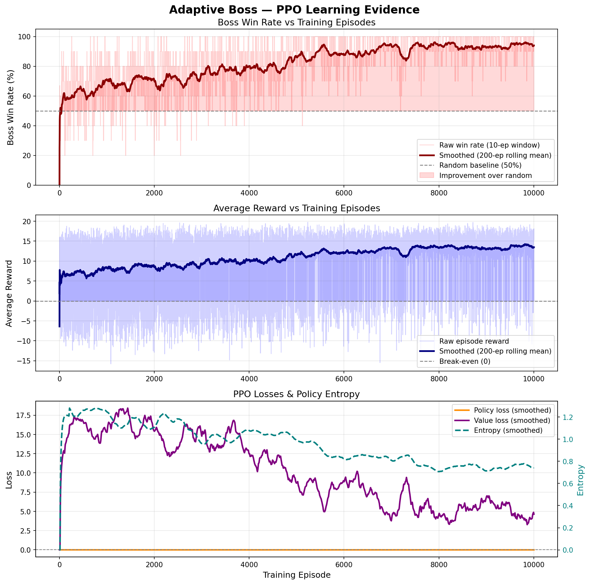
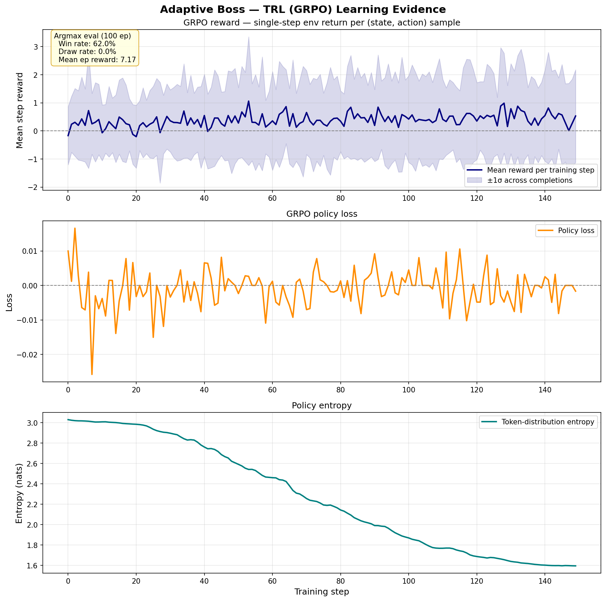

# 🎮 Adaptive Boss — OpenEnv RL Environment

> *"Every Elden Ring player has cheesed a boss. We made the boss learn your cheese — and punish you for it."*

**Meta × Scaler OpenEnv Hackathon — Round 2 | Bangalore, April 25–26, 2026**

**Theme:** Self-Improving Agent Systems + World Modeling

---

## The Problem

In games like Elden Ring, Dark Souls, and Sekiro — players discover "cheese strategies":
exploits that trivialize boss fights. Dodge left twice, attack. Repeat. Boss dies. Every time.

This breaks game balance and destroys the intended experience. Studios patch individual
exploits reactively — a losing battle.

**What if the boss could learn your cheese and punish you for it?**

---

## The Environment

An RL environment where a boss enemy learns to counter player behavior using PPO.

### How It Works

The player samples one of **five cheese strategies** at the start of each fight, and
may stochastically swap to another strategy mid-fight (5–20% chance per step) and
inject defensive moves (10–25% chance per step). The boss has to detect from the
last 10 moves *which* strategy is currently running and counter it — and notice
when the distribution shifts.

| Strategy | Cycle |
|---|---|
| `left_cheese` | `dodge_left → dodge_left → attack` |
| `right_cheese` | `dodge_right → dodge_right → attack` |
| `alternating` | `dodge_left → attack → dodge_right → attack` |
| `double_dodge` | `dodge_left → dodge_left → dodge_right → dodge_right → attack` |
| `feint` | `attack → dodge_left → dodge_left → attack → dodge_right` |

**State Space (13 dimensions):**
- Last 10 player moves, normalized to `[0, 1]` (padding=0.0, dodge_left=0.2, dodge_right=0.4, attack=0.6, idle=0.8, defend=1.0)
- Boss health (normalized 0-1)
- Player health (normalized 0-1)
- Current timestep (normalized 0-1)

**Action Space (4 actions):**
- `attack_left` — strike the left side
- `attack_right` — strike the right side
- `reposition` — recover and reset stance
- `defend` — block; cancels an incoming player attack

### The Reward Signal (Dense, Composite, Ungameable)

| Signal | Value | Description |
|---|---|---|
| Boss lands hit | +2.0 | Boss attack connected |
| Correct prediction (no hit) | +0.5 | Right side, blocked / missed |
| Player lands hit | −1.0 | Player damaged boss |
| Successful defend (block) | +0.2 | Boss-defend caught a player attack |
| Wasted defend | −0.15 | Boss-defend with no incoming attack |
| Reposition | −0.05 | Per-step stalling penalty |
| Wrong streak (3×) | −0.5 | Attacked wrong side 3 times in a row |
| Episode win | +5.0 | Player health reaches 0 |
| Episode loss | −5.0 | Boss health reaches 0 |
| Timeout draw | −2.0 | Both alive at step cap |
| Improvement bonus | +0.5 | Win rate improving over last 20 eps |

**Why this reward cannot be gamed:**
- Reposition farming → −0.05/step accumulates negative
- Always-defend collapse → wasted-defend (−0.15) dominates plus −2.0 if it stalls into a draw (verified: always-defend scores −12.30/ep vs +4.81 for random)
- Always-attack-same-side → wrong-streak (−0.5) fires within 3 misses
- Hit and prediction don't double-count — boss must actually land damage, not just guess right

---

## Training Results

The env ships with **two parallel training pipelines**, both targeting the same
5-strategy env, same reward signal, same 4-action space:

| Pipeline | Stack | Status | Outcome |
|---|---|---|---|
| **Custom PPO** (`train.py` + `rl/trainer.py`) | PyTorch, hand-rolled actor-critic | Production model (v7, shipped in `models/boss_policy.pt`) | 10 000 ep · 54% → **91%** smoothed WR · 98% argmax WR · all 4 actions used |
| **TRL GRPO** (`train_trl.py` + `Adaptive_Boss_Train.ipynb`) | Hugging Face `trl.GRPOTrainer` driving a tiny GPT-2 policy | Hackathon-required reproducible pipeline (Colab) | 150 steps · reward −0.17 → +0.53 · entropy 3.0 → 1.6 · 62% argmax WR vs ~30% random baseline |

The Colab notebook (`Adaptive_Boss_Train.ipynb`) re-runs the TRL pipeline
end-to-end from scratch in 5–10 minutes on a Colab GPU. See `logs/trl_training_curve.png`
for the TRL learning curve.

### Custom PPO (production model)

PPO actor-critic, 13→64→64→{4,1}, GAE-λ=0.95, clip=0.2, lr=3e-4, entropy=0.05.
Trained on the **5-strategy** env with stochastic switching and defends.

| Metric | Random (untrained) | Trained (PPO, 10 000 ep) |
|---|---|---|
| Smoothed win rate (start → end) | ~50% (chance) | **54% → 91%** (Δ +37pp, peak 97%, 200-ep window) |
| Smoothed reward (start → end) | ~3–4 | 5.11 → **13.16** (Δ +8.05) |
| Argmax eval (200 ep) | ~30–35% wins | **98.0% wins, 0 draws** |
| Action distribution (argmax) | uniform 25/25/25/25 | ATK_L 34% · DEF 29% · REPOS 22% · ATK_R 16% (all 4 used, no collapse) |
| Per-strategy argmax WR | — | left 94% · right 100% · alt 100% · double_dodge 98% · feint 97% |



Three-panel figure, smoothed over a 200-episode rolling window with raw points
shown lighter:

1. **Win rate** — boss wins as a percentage, with random-baseline guideline
2. **Reward** — average per-episode reward
3. **PPO losses** — policy loss and value loss on the left axis, policy entropy
   on the twin right axis (dashed)

### TRL GRPO (hackathon-reproducible pipeline)

`train_trl.py` builds a 105K-parameter GPT-2 (`n_layer=2, n_head=2, n_embd=64`)
with a 21-token domain vocabulary. Each prompt encodes the 13-dim env state as
a short token sequence; each completion is a single action token in `{L,R,M,D}`;
the reward function decodes the action, restores the env from a per-prompt
snapshot, calls `env.step(action)`, and returns the immediate reward. GRPOTrainer
samples `num_generations=4` completions per prompt, applies the env-step reward,
and performs the GRPO clipped policy update — all on the same reward shaping
the custom PPO uses.



This is **single-step bandit training**, not full episodic RL — the long-horizon
credit assignment is what the production custom-PPO buys you. The TRL run still
beats the random baseline (62% argmax WR vs ~30% random) and shows clean
monotonic improvement on reward and entropy, demonstrating the env is fully
trainable on the HF stack.

---

## The BOSS BRAIN Panel

The live demo (`play.py`) shows the boss's internal model updating in real time:

- **Player Pattern bar chart** — last-10-move frequencies for dodge_left / dodge_right / attack
- **Pattern Lock meter** — fills 0 → 10 as the move-history window fills
- **Strategy Switch indicator** — switch count + per-step switch probability (per-episode random)
- **Predicts label** — argmax of the policy's next action
- **Win Rate graph** — rolling 20-episode win rate
- **Policy Confidence bars** — live softmax over the 4 boss actions
- **Online Adaptation status** — running policy-gradient updates from a 20-step replay buffer (cosmetic in the demo, mutates a clone of the policy)

A 3-frame "⚠ PLAYER SWITCHED STRATEGY" flash fires every time the player changes
strategy mid-fight, so judges can see exactly when distribution shift happens.

---

## Real-World Application

Game studios collect millions of player sessions. This environment simulates:

1. **Offline training phase** — boss policy trained on aggregated player data
2. **Online adaptation** — pre-trained policy adapts within a single fight using 10-move window
3. **Result** — by move 10 of any fight, boss has identified the cheese and locked the counter

No patches needed. The boss learns.

---

## Quick Start

```bash
git clone <repo>
cd adaptive_boss
pip install -r requirements.txt

# ── Custom PPO (production, ~20 min for 10 000 ep on CPU) ─────────────
python train.py --episodes 10000
python generate_plots.py     # regenerate logs/training_curve.png

# ── TRL GRPO (hackathon-reproducible, ~30 sec on CPU / faster on GPU) ─
python train_trl.py --n_states 1500 --epochs 4 --num_generations 4 \
                    --per_device_batch_size 16 --eval_episodes 100
python generate_trl_plot.py  # regenerate logs/trl_training_curve.png

# Or run end-to-end in Colab — open Adaptive_Boss_Train.ipynb

# ── Live demo (Pygame split-screen + BOSS BRAIN panel) ────────────────
python play.py
# Controls:
#   T   cycle trained / untrained / human modes
#   R   reset episode
#   O   toggle the cosmetic online adapter
#   Q   quit
# In human mode:
#   ←   dodge left
#   →   dodge right
#   SPACE  attack
#   D   defend

# ── OpenEnv server (FastAPI, conformant) ──────────────────────────────
PYTHONPATH=../OpenEnv/src:. python -m uvicorn server.app:app --port 8000
```

---

## OpenEnv conformance

This env wraps over the [OpenEnv](https://github.com/meta-openenv/OpenEnv) `Environment`
base — Pydantic action / observation / state types, a FastAPI app via
`create_fastapi_app(...)`, a `Dockerfile`, and an `EnvClient[...]`-based Python
client. See `server/`, `client.py`, `models.py`, `openenv.yaml`.

```python
from adaptive_boss import AdaptiveBossEnv, BossAction
env = AdaptiveBossEnv(base_url="http://localhost:8000")
obs = env.reset()
result = env.step(BossAction(action_id=3))  # defend
print(result.observation, result.reward, result.done)
```

---

## Limitations (honest framing)

The boss generalizes within the trained distribution: 5 cheese strategies +
stochastic per-step switching (5–20%) + stochastic defend injection (10–25%).
Truly novel patterns outside this distribution — e.g. a player who deliberately
mirrors the boss's prediction history — will degrade performance. The 10-move
window is also a hard ceiling: if the cheese cycle is longer than 10 moves the
boss can't recover the period.

---

## Built For

Meta × Scaler OpenEnv Hackathon — Round 2 Onsite, Bangalore, April 25–26, 2026

**Algorithm:** PPO (Proximal Policy Optimization), PyTorch
**Framework:** OpenEnv-conformant FastAPI server + Pydantic schema + EnvClient
**Training:** Headless, ~20 min for 10 000 episodes on CPU
